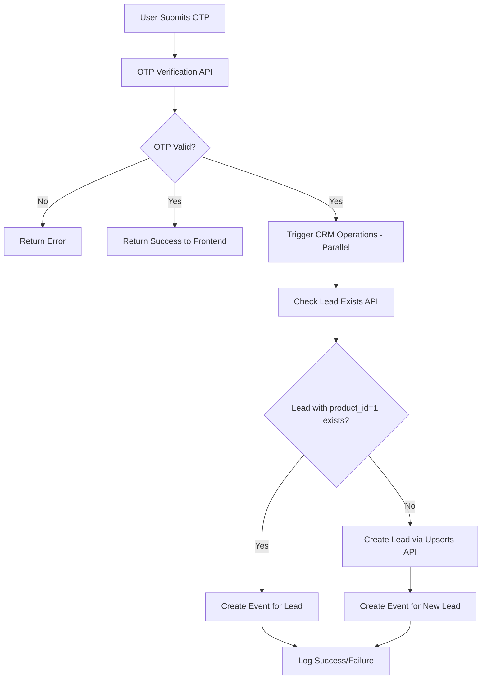

# CRM Integration Plan

## Overview

This document outlines the plan to integrate CRM API calls after successful OTP verification. When a user verifies their OTP, the system will:

1. Check if a lead already exists in the CRM with the given phone number
2. If a lead exists with `product_id = 1` (Shikho), create an event for that lead
3. If no lead exists with `product_id = 1`, create the lead first, then create an event

## Architecture



## CRM API Endpoints

### Base Configuration
- **Base URL**: `https://crm-api.shikho.com/api/v1/`
- **Authentication**: Bearer Token (stored in environment variable)

### 1. Check Lead Exists
```
GET /leads?cols=lead_stage_id;prospect_id;owner_id;product_id&search=mobile:{mobile}&conditions=mobile:=
```

**Response**: Returns array of leads matching the phone number. Each lead contains `product_id` to identify Shikho (1) vs Bohubrihi (2) leads.

### 2. Create/Update Lead
```
POST /leads/upserts
```

**Payload for Lead Creation**:
```json
{
  "product_id": 1,
  "name": "User Name",
  "mobile": "8801XXXXXXXXX",
  "source": "free-resource-panel",
  "cf_class": "{dynamic - based on classId, e.g., c5 → C5}",
  "cf_passing_year": "{dynamic - based on classId, e.g., c5 → 2031}",
  "cf_group": "{dynamic - NONE for C5-C8, SCI/HUM/BS for C9-C12}"
}
```

### 3. Create Event
```
POST /events
```

**Payload**:
```json
{
  "type": "campaign_form_submission",
  "product_id": 1,
  "lead_prospect_id": "{prospectID from lead check or lead creation}",
  "cf_form_type": "ORGANIC",
  "cf_form_name": "YT_Free_Video",
  "cf_class": "{dynamic - based on classId, e.g., c5 → C5}",
  "cf_passing_year": "{dynamic - based on classId, e.g., c5 → 2031}",
  "cf_group": "{dynamic - NONE for C5-C8, SCI/HUM/BS for C9-C12}"
}
```

## Data Mappings

### Class to CRM Format Mapping (from class_batch.md)
| Class Slug | CRM cf_class | SSC Year (cf_passing_year) |
|------------|--------------|---------------------------|
| c5         | C5           | 2031                      |
| c6         | C6           | 2030                      |
| c7         | C7           | 2029                      |
| c8         | C8           | 2028                      |

> **Note**: The mapping is derived from `class_batch.md`. Additional classes (C9-C12) can be added following the same pattern when needed.

### Group Mapping (cf_group)
| User Selection | CRM Value | Applicable Classes |
|----------------|-----------|-------------------|
| N/A            | NONE      | C5, C6, C7, C8    |
| science        | SCI       | C9, C10, C11, C12 |
| humanities     | HUM       | C9, C10, C11, C12 |
| business       | BS        | C9, C10, C11, C12 |

## Implementation Strategy

### Phase 1: Backend Infrastructure
1. Create CRM service module with API client
2. Add environment variable for CRM API Bearer token
3. Implement helper functions for data mapping

### Phase 2: CRM API Integration
1. Implement check lead function
2. Implement create lead function
3. Implement create event function

### Phase 3: Integration with OTP Verification
1. After successful OTP verification, trigger CRM operations
2. CRM operations should run in parallel (non-blocking) - not delay the user response
3. Log success/failure for monitoring

## File Structure

```
lib/
├── api/
│   ├── otp.ts           (existing)
│   └── crm.ts           (new - CRM client functions)
├── config/
│   ├── classes.ts       (existing - may need updates)
│   └── crm-mappings.ts  (new - class/group mappings)
└── services/
    └── crm-service.ts   (new - CRM business logic)

app/
└── api/
    └── otp/
        └── verify/
            └── route.ts  (update - integrate CRM calls)
```

## Environment Variables

```env
CRM_API_BASE_URL=https://crm-api.shikho.com/api/v1
CRM_API_TOKEN=eyJ0eXAiOiJKV1QiLCJhbGciOiJSUzI1NiJ9...
```

## Error Handling

- CRM API failures should NOT block the user flow
- All CRM operations run asynchronously after returning success to the user
- Errors should be logged for monitoring/debugging
- Consider retry mechanism for transient failures

## Testing Considerations

1. Mock CRM API responses in debug mode
2. Test lead exists vs lead not exists scenarios
3. Test event creation after lead creation
4. Verify correct class/group mappings
5. Test error handling when CRM API fails